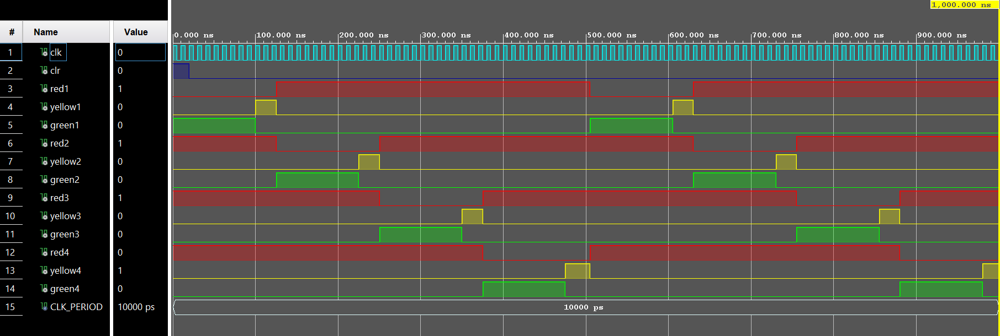
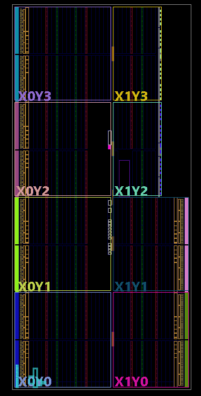
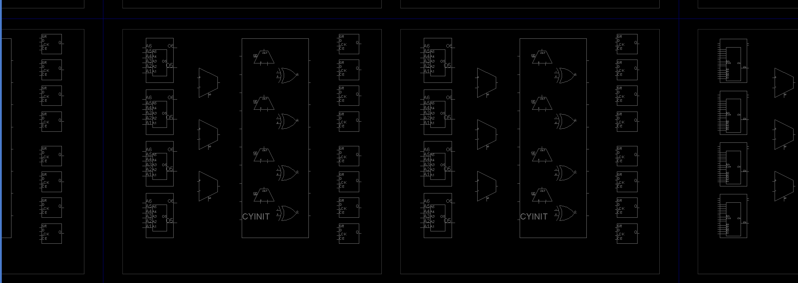

# ATLC Design: DSP-driven Urban Traffic Control using VHDL

## Introduction

This repository contains the design and implementation of an Automated Traffic Light Controller (ATLC) system using VHDL and Digital Signal Processing (DSP) techniques. The project aims to address the challenges faced in urban traffic management and intersection control by dynamically adjusting traffic light timings based on real-time data.

## Components and Tools

The project is developed using the Vivado Design Suite, which provides a comprehensive environment for FPGA design and simulation.

## Content

- **Design Code**: VHDL code implementing the ATLC system, defining states, state transition logic, and output signals.
- **Testbench Code**: VHDL code for simulating the traffic light system, setting up the simulation environment, and applying stimuli.
- **README.md**: Detailed description of the project, including its objectives, methodology, results, and conclusion.

## Usage

To utilize this project:

1. Clone the repository to your local machine.
2. Open the project in Vivado Design Suite.
3. Simulate the design to observe the behavior of the traffic light system.
4. Analyze the results and modify the code as needed for further experimentation.

## Image Positions

1. 
   This image illustrates the simulation output of the automated controlled traffic system, displaying the status of traffic lights at different directions.

2. 
   The initial diagram provides an overview of the traffic light system's design and structure.

3. 
   This image offers a closer look at the components and connections inside the traffic light system.

4. 
   The circuit diagram visually represents the hardware implementation of the traffic light controller.

## Contribution

Contributions to enhance the functionality, efficiency, or documentation of the project are welcome. Feel free to fork the repository, make improvements, and create a pull request.

## License

This project is licensed under the [NULL](NULL).
