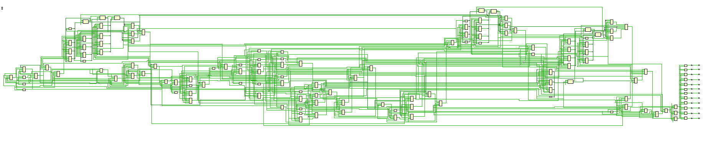

# ATLC Design: DSP-driven Urban Traffic Control using VHDL

## Introduction

This repository contains the design and implementation of an Automated Traffic Light Controller (ATLC) system using VHDL and Digital Signal Processing (DSP) techniques. The project aims to address the challenges faced in urban traffic management and intersection control by dynamically adjusting traffic light timings based on real-time data.

## Components and Tools

The project is developed using the Vivado Design Suite, which provides a comprehensive environment for FPGA design and simulation.

## Content

- **Design Code**: VHDL code implementing the ATLC system, defining states, state transition logic, and output signals.
- **Testbench Code**: VHDL code for simulating the traffic light system, setting up the simulation environment, and applying stimuli.

## Image Positions

1. 
   This image illustrates the simulation output of the automated controlled traffic system, displaying the status of traffic lights at different directions.

2. 
   The initial diagram provides an overview of the traffic light system's design and structure.

3. 
   This image offers a closer look at the components and connections inside the traffic light system.

4. 
   The circuit diagram visually represents the hardware implementation of the traffic light controller.

## Methodology

To simulate the traffic light system, we follow a systematic approach:

1. **Definition of Components**: The simulation comprises two main parts: the testbench code and the design code. The testbench code establishes the simulation environment, while the design code implements the traffic light controller logic.

2. **State Definition**: In the design code, we begin by defining the states of the traffic light system using an enumerated type. Each state represents a combination of red, yellow, and green lights for each direction.

3. **State Transition Logic**: Processes are utilized to define the behavior of the system. One process updates the state based on the current count, tracking the timing of each state transition. Another process updates the output signals (red, yellow, and green lights) based on the current state.

4. **Output Signal Mapping**: The state process updates the lights using a case statement, where each state corresponds to a specific pattern of lights for each direction. The count process increments the count value based on the clock signal, triggering state transitions at certain values.

5. **Simulation Setup**: Output signals from the design code are mapped to signals in the testbench code, allowing observation of the traffic light system behavior during simulation.

## Output Discussion

The simulation output provides insights into the behavior of the traffic light system:

- **Signal Representation**: Signals such as red1, yellow1, and green1 for direction 1, and corresponding signals for other directions, represent the status of each traffic light during simulation.

- **Interpretation**: High values of these signals indicate the respective traffic lights are red, yellow, or green at any given time. For instance, red1 being high signifies a stop signal for vehicles in direction 1, while green1 being high allows vehicles to proceed.

- **Real-life Reflection**: The output signals accurately mirror the behavior of actual traffic lights, ensuring smooth traffic flow, minimizing accident risks, and promoting safety at intersections.

Overall, the simulation effectively captures the dynamics of the traffic light system, facilitating analysis and optimization of traffic control strategies.

## Contribution

Contributions to enhance the functionality, efficiency, or documentation of the project are welcome. Feel free to fork the repository, make improvements, and create a pull request.

## License

This project is licensed under the [NULL](NULL).
